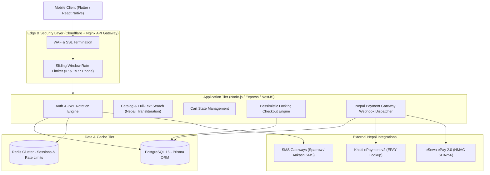

# Dhanshree Backend Architecture & Database Contract Specification

> **Platform:** Node.js (TypeScript / NestJS / Express) + PostgreSQL 16 + Prisma ORM  
> **Market Context:** Nepal C2C & B2C E-Commerce (eSewa, Khalti, Fonepay, COD, +977 SMS OTP)  
> **Target SLA:** <150ms P95 latency, 99.99% payment idempotency, zero inventory oversell.

---

## 1. Architectural Overview & System Design



---

## 2. Database Normalization & Modeling Decisions

The schema is implemented in [`schema.prisma`](file:///C:/Users/Admin/.gemini/antigravity/brain/a10408c1-0c7e-4f69-8ee6-ffc1f84eb625/schema.prisma). Key architectural decisions include:

### 2.1 The Nepal Addressing Model
- **No Reliance on Postal Codes:** Street zip codes in Nepal are largely unfunctional for couriers.
- **Hierarchical Geo-Taxonomy:** `Province (Enum: 1-7)` → `District` → `Municipality / Gaunpalika` → `Ward Number` → `Tole / Street Name` → `Landmark`.
- **Historical Snapshotting:** When an order is placed, a copy of the address is frozen into `Order.shippingSnapshot (Json)`. If the customer later updates their address in the address book, historical order logistics remain unmodified.

### 2.2 Financial & Inventory Integrity
- **High-Precision Decimals:** All financial fields (`subtotalNpr`, `deliveryFeeNpr`, `discountNpr`, `totalAmountNpr`, `priceNpr`) use `Decimal(12, 2)` instead of floating points to prevent floating-point IEEE-754 calculation inaccuracies.
- **Atomic Stock Reservation:** High-traffic flash sales (*Dhamaka Deals*) prevent overselling via database transactions.

---

## 3. High-Traffic Checkout & Concurrency Controls

To guarantee that two users buying the last item of a product simultaneously cannot both succeed:

```typescript
// Atomic Checkout with Inventory Deduction
await prisma.$transaction(async (tx) => {
  for (const item of cartItems) {
    // 1. Decrement stock atomically with conditional check (stockQuantity >= requested)
    const updated = await tx.productVariant.updateMany({
      where: {
        id: item.variantId,
        stockQuantity: { gte: item.quantity },
      },
      data: {
        stockQuantity: { decrement: item.quantity },
      },
    });

    if (updated.count === 0) {
      throw new Error(`INSUFFICIENT_STOCK_FOR_VARIANT_${item.variantId}`);
    }
  }

  // 2. Create Order & Initial Payment Transaction
  const order = await tx.order.create({ /* ... */ });
  return order;
});
```

---

## 4. Payment Gateway Verification (eSewa & Khalti)

Implemented in [`src/payment.service.ts`](file:///C:/Users/Admin/.gemini/antigravity/brain/a10408c1-0c7e-4f69-8ee6-ffc1f84eb625/src/payment.service.ts):

### 4.1 eSewa ePay 2.0 Security Handshake
1. **Outbound Signature:** Client POSTs signed parameters generated with server HMAC:
   $$\text{Signature} = \text{Base64}\Big(\text{HMAC-SHA256}\big(K_{\text{secret}}, \text{"total\_amount="} + A + \text{",transaction\_uuid="} + U + \text{",product\_code="} + P\big)\Big)$$
2. **Inbound Validation:** Decodes base64 callback, recalculates signature, and executes a second-line server-to-server check against `https://rc-epay.esewa.com.np/api/epay/transaction/status/`.

### 4.2 Khalti v2 EPAY Handshake
1. Client completes in-app payment with Khalti SDK and receives a `pidx` token.
2. Backend queries `https://khalti.com/api/v2/epayment/lookup/` with secret header `Key <KHALTI_SECRET_KEY>`.
3. Order moves to `ORDER_PLACED` only if API reports `status: "Completed"`.

---

## 5. Security & Rate-Limiting Stack

Implemented in [`src/auth.middleware.ts`](file:///C:/Users/Admin/.gemini/antigravity/brain/a10408c1-0c7e-4f69-8ee6-ffc1f84eb625/src/auth.middleware.ts) and [`src/otp-rate-limiter.ts`](file:///C:/Users/Admin/.gemini/antigravity/brain/a10408c1-0c7e-4f69-8ee6-ffc1f84eb625/src/otp-rate-limiter.ts):

### 5.1 Refresh Token Rotation (RTR) with Reuse Detection
- **Token Family Identifier:** Each token chain shares a UUID `family`.
- **Compromise Invalidation:** If a stale/revoked refresh token is re-submitted (indicating token theft), the entire family is immediately revoked, forcing the attacker and user out.

### 5.2 SMS Pumping Protection
- **Phone Level:** Max 3 OTP sends per 10 minutes with strict **60-second cooldown** between clicks.
- **IP Level:** Max 10 sends per 10 minutes across any number.
- **Brute-Force Lockout:** 3 incorrect OTP entries locks the number for 15 minutes.
