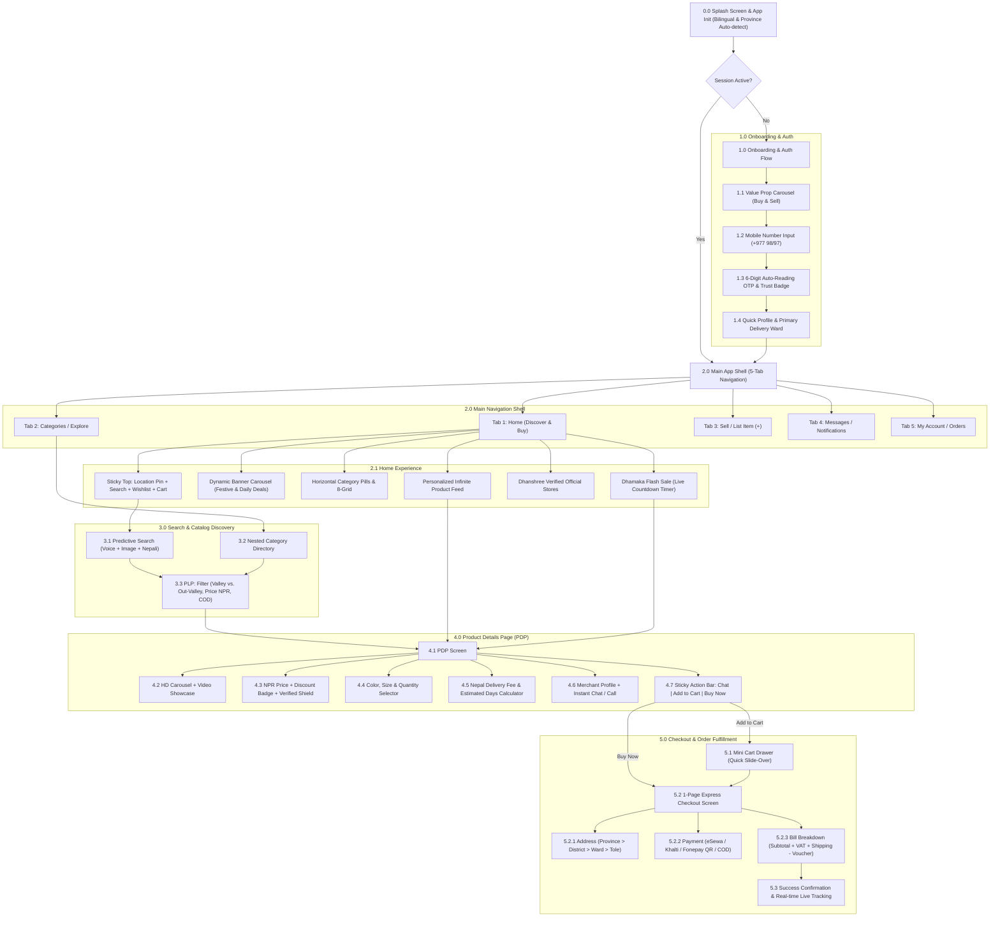

# Dhanshree Mobile App: Design System & UX/UI Architecture Specification

> **Platform:** iOS & Android (Cross-Platform Flutter / React Native Native Design)  
> **Target Market:** Nepal (C2C & B2C E-Commerce)  
> **Core Brand Essence:** Prosperity (*Dhan*), Trust, Speed, and Cultural Affinity  
> **Brand Palette:** Deep Royal Navy Blue (`#0F172A`), Emerald Growth Green (`#10B981`), Warm Prosperity Gold (`#F59E0B`), Clean Off-White (`#F8FAFC`)

---

## 1. Information Architecture (IA) & User Journey Map

### 1.1 Strategic Ecosystem & Localization Context
The Nepali e-commerce ecosystem presents unique physical and behavioral realities that dictate product architecture:
1. **Addressing System:** Formal street numbers are virtually non-existent outside select areas. The IA must prioritize hierarchical geographical addressing: **Province (1–7) → District → Municipality/Gaunpalika → Ward No. → Tole/Landmark/House Description**.
2. **Payment Trust & Adoption:** Digital wallets (**eSewa, Khalti, Fonepay**) and **Cash on Delivery (COD)** are non-negotiable. COD requires anti-fraud safeguards (OTP verification upon order placement or delivery).
3. **Bilingual Accessibility:** 68%+ of mobile internet users browse comfortably in English but demand Nepali transliteration and Devanagari numerals/prompts for checkout terms, trust badges, and price clarity.
4. **C2C and B2C Synergy:** "Dhanshree" is built for both purchasing from verified merchants and listing pre-loved or artisanal goods with 1-click photo uploads and direct buyer-seller WhatsApp/in-app messaging.

---

### 1.2 Information Architecture (IA) Diagram



---

### 1.3 End-to-End User Journey Map: Splash to Checkout

| Journey Phase | 1. Discovery & Onboarding | 2. Browsing & Intent | 3. Evaluation (PDP) | 4. Decision & Cart | 5. Express Checkout | 6. Post-Purchase Fulfillment |
| :--- | :--- | :--- | :--- | :--- | :--- | :--- |
| **User Goal** | Access trusted deals quickly; verify app authenticity. | Find desired product or spot seasonal offers (*Dashain/Tihar*). | Assess authentic product specs, price in NPR, delivery time to their town. | Confirm variant, check shipping costs, apply discount coupon. | Frictionless payment via local wallet or COD with clear address. | Track parcel from Kathmandu hub to doorstep. |
| **Key Screen / Touchpoint** | Splash Screen & Phone OTP Login. | Sticky Search, Hero Banner, Flash Sale countdown. | Product Details Page (PDP), Seller Chat trigger. | Bottom Sheet Cart Drawer. | 1-Page Consolidated Checkout Screen. | Order Status Screen + SMS / WhatsApp alerts. |
| **User Thoughts** | *"Is this platform reliable? Will it spam me?"* | *"Are these items actually in stock in Nepal?"* | *"Is delivery possible to Pokhara/Dharan? How much is shipping?"* | *"Can I get free delivery if I add one more item?"* | *"Will my eSewa payment bounce? Is COD safer?"* | *"When will the courier call me? Who delivers it?"* |
| **Pain Points** | Lengthy email forms, dropped SMS OTPs, unclear telecom routing. | Overwhelming catalogs, fake discounts, slow image loading on 3G/4G networks. | Unclear return policies, vague shipping time, hidden delivery charges. | Complex cart management, losing items during navigation. | Multi-step reload screens, entering street address with no zip code. | Zero dispatch tracking, missed courier phone calls. |
| **UX & Design Solutions** | **+977 auto-prefix**, 1-tap SMS autofill, biometric re-auth, trust badge (*100% Nepali Buyer Protection*). | Optimized progressive WebP images, localized sticky search with voice input, clear stock indicators. | Transparent delivery badge with **Ward/District delivery calculator**, 7-day return guarantee, direct seller chat. | Interactive Cart Drawer with live delivery free-tier progress bar; persistent item memory. | **1-page accordion checkout**: Geo-dropdown for Nepal, 1-tap eSewa/Khalti deep links, COD fallback. | Live milestone timeline, courier direct contact card, dual English/Nepali SMS updates. |

---

## 2. Screen-by-Screen Layout Specifications (Figma Structure)

All layouts are designed on an **8pt grid / 4pt baseline** for a mobile standard viewport of **393 x 852 px** (iOS iPhone 16 / modern Android Flagship base).

---

### Screen 1: Onboarding & Phone OTP Login

#### Figma Component Hierarchy & Layer Naming
```
Frame: [Screen] Onboarding_OTP (393x852, Fill: #F8FAFC, Clip: True)
 ├── Frame: StatusBar_iOS (393x44, Layout: Horizontal, Padding: [14, 21])
 ├── Frame: TopBar_Utility (393x48, Layout: Horizontal, Align: Center, SpaceBetween)
 │    ├── Component: BrandLogo_Mark ("Dhanshree" Crest in Navy & Gold, 32x32)
 │    └── Component: LanguageSelector_Pill (EN | नेपाली Switcher, Hug Content, Radius: 999)
 ├── Frame: Hero_Illustration_Area (393x260, Layout: Vertical, Align: Center, Gap: 16)
 │    ├── Instance: VectorArt_CommerceNepal (Isometric safe delivery & digital wallet graphic)
 │    ├── Component: PaginationDots_Carousel (3 items, Active: Gold #F59E0B width 24px pill, Inactive: Slate 8px dot)
 │    └── Text: "Nepal's Trusted Marketplace" (Poppins Bold 22pt, #0F172A)
 ├── Frame: Auth_Card_Container (393xAuto, Fill: #FFFFFF, RoundedTop: 24, Padding: [24, 20, 32, 20], Gap: 20, Shadow: Elevation-3)
 │    ├── Frame: Text_Header_Block (Fill: 100%, Gap: 6)
 │    │    ├── Text: "Sign in with Mobile" (Poppins SemiBold 18pt, #0F172A)
 │    │    └── Text: "We'll send a 6-digit verification code to your number" (Inter Regular 13pt, #64748B)
 │    ├── Frame: Phone_Input_Group (Fill: 100%, Height: 54, Layout: Horizontal, Gap: 8)
 │    │    ├── Component: CountryCode_Pill (Width: 92, Fill: #F1F5F9, Radius: 12, Content: Nepal Flag + "+977")
 │    │    └── Component: TextField_Mobile (Fill: 100%, Radius: 12, Border: 1.5px #CBD5E1, Placeholder: "98XXXXXXXX")
 │    ├── Frame: OTP_Input_Group (Hidden by default, Active on state 'OTP_SENT')
 │    │    ├── Frame: Digit_Slots_6x (Layout: Horizontal, SpaceBetween, Gap: 8)
 │    │    │    └── Component: OTP_Slot [x6] (Width: 48, Height: 56, Radius: 12, Border: 1.5px, Font: 22pt Bold)
 │    │    └── Frame: Resend_Timer_Row (Layout: Horizontal, SpaceBetween)
 │    │         ├── Text: "Didn't receive code?" (Inter 12pt, #64748B)
 │    │         └── TextButton: "Resend in 00:45" (Inter SemiBold 12pt, #10B981)
 │    ├── Component: Button_Primary_CTA (Height: 52, Fill: #10B981, Radius: 14, Label: "Get OTP / Verify", Font: Poppins SemiBold 16pt #FFFFFF)
 │    ├── Frame: Divider_Or (Layout: Horizontal, Align: Center, Gap: 12)
 │    │    ├── Line (Fill: #E2E8F0)
 │    │    ├── Text: "or continue as guest" (Inter 12pt, #94A3B8)
 │    │    └── Line (Fill: #E2E8F0)
 │    └── Frame: Trust_Badges_Row (Layout: Horizontal, Align: Center, Gap: 16)
 │         ├── Item: ShieldCheckIcon + "100% Encrypted"
 │         └── Item: NepalGovIcon + "Registered Marketplace"
 └── Frame: HomeIndicator_iOS (393x34, Align: Bottom Center)
```

#### States & Micro-interactions
- **Default State:** Mobile input active, cursor auto-focused with numeric keyboard. Country code lock at `+977`.
- **Typing State:** Format as `98XX-XXXXXX`. When length reaches 10 digits, CTA button illuminates with Emerald Green shimmer and enables.
- **OTP Screen Transition:** Instant morph; 6 inputs with auto-focus advancing to the next slot upon keydown; iOS SMS auto-fill populates all 6 slots in one tap.

---

### Screen 2: Homepage (Discover & Shop)

#### Figma Component Hierarchy & Layer Naming
```
Frame: [Screen] Home_Main (393x852, Fill: #F8FAFC)
 ├── Frame: Sticky_Header_Group (393x108, Fixed Top, Fill: #0F172A, Z-Index: 100)
 │    ├── Frame: Top_Location_Row (393x44, Padding: [8, 16], Layout: Horizontal, SpaceBetween)
 │    │    ├── Frame: Location_Badge (Layout: Horizontal, Gap: 6, Align: Center)
 │    │    │    ├── Icon: Pin_Filled (16x16, Fill: #F59E0B)
 │    │    │    ├── Text: "Deliver to: New Baneshwor, Kathmandu" (Inter Medium 12pt, #F8FAFC)
 │    │    │    └── Icon: ChevronDown (12x12, Fill: #94A3B8)
 │    │    └── Frame: Top_Actions (Layout: Horizontal, Gap: 12)
 │    │         ├── Component: Notification_Icon (With Red unread dot, 24x24)
 │    │         └── Component: Cart_Badge_Icon (With Gold badge counter '2', 24x24)
 │    └── Frame: Search_Bar_Module (393x52, Padding: [0, 16, 12, 16])
 │         └── Component: SearchBar_Container (Fill: #FFFFFF, Height: 44, Radius: 12, Layout: Horizontal, Padding: [0, 12])
 │              ├── Icon: Search (20x20, #64748B)
 │              ├── Text: "Search electronics, clothes, local goods..." (Inter 13pt, #94A3B8)
 │              ├── Icon: Mic (18x18, #64748B)
 │              └── Icon: Camera_Scan (18x18, #0F172A)
 ├── Frame: Scrollable_Content_Area (393xAuto, Layout: Vertical, Gap: 20, Scroll: Vertical)
 │    ├── Frame: Hero_Banner_Carousel (393x170, Layout: Horizontal, Overflow: Scroll, Gap: 12, Padding: [12, 16])
 │    │    ├── Component: BannerCard_Active (Width: 361, Height: 156, Radius: 16, Fill: Navy Gradient, Content: "Dashain Mahabachat - Up to 60% Off")
 │    │    └── Component: BannerCard_Peek (Width: 361, Height: 156, Radius: 16, Fill: Emerald Gradient)
 │    ├── Frame: Category_Grid_Section (393xAuto, Padding: [0, 16], Gap: 12)
 │    │    ├── Frame: Section_Header (SpaceBetween: "Top Categories" | "View All >")
 │    │    └── Frame: Grid_2x4 (Layout: Grid, 4 Columns, Gap: 12)
 │    │         ├── CatItem: [Mobiles & Tech] (Circle 56px #F1F5F9, Icon, Label 11pt)
 │    │         ├── CatItem: [Nepali Handicrafts & Poshak]
 │    │         ├── CatItem: [Men's Fashion]
 │    │         ├── CatItem: [Women's Fashion]
 │    │         ├── CatItem: [Groceries & Organic]
 │    │         ├── CatItem: [Home & Kitchen]
 │    │         ├── CatItem: [Beauty & Health]
 │    │         └── CatItem: [Pre-Loved / C2C Deals]
 │    ├── Frame: Flash_Sale_Dhamaka_Banner (393xAuto, Fill: #0F172A, Padding: [16, 16], Radius: 16, Gap: 12)
 │    │    ├── Frame: Flash_Header_Row (Layout: Horizontal, SpaceBetween, Align: Center)
 │    │    │    ├── Frame: Title_Timer (Layout: Horizontal, Gap: 8)
 │    │    │    │    ├── Text: "⚡ Flash Deals" (Poppins Bold 16pt, #FFFFFF)
 │    │    │    │    └── Component: Countdown_Timer_Pill (Fill: #F59E0B, Radius: 6, Text: "02h : 45m : 12s", Bold 12pt #0F172A)
 │    │    │    └── TextButton: "See All" (#10B981)
 │    │    └── Frame: Flash_Horizontal_Scroll (Gap: 12, Scroll: Horizontal)
 │    │         └── Component: FlashProductCard [x4] (Width: 140, Image 1:1, Price: "Rs. 1,499", Strikethrough: "Rs. 2,500", StockBar: 80% claimed)
 │    └── Frame: Product_Feed_Masonry (393xAuto, Padding: [0, 16], Gap: 16)
 │         ├── Text: "Recommended For You" (Poppins SemiBold 16pt, #0F172A)
 │         └── Frame: Dual_Column_Grid (2 Columns, Gap: 12)
 │              └── Component: ProductCard_Standard (Width: 174, Radius: 12, Fill: #FFFFFF, Border: 1px #E2E8F0, Padding: 8)
 │                   ├── Frame: Image_Box (Height: 160, Radius: 8, Wishlist Heart Top-Right, "Valley Express" Tag)
 │                   ├── Text: "Nepali Handwoven Dhaka Shawl" (Inter Medium 13pt, Max 2 lines)
 │                   ├── Text: "रु १,८५०" (Poppins Bold 15pt, #0F172A)
 │                   ├── Frame: Rating_Row (Stars 4.8 + "(128)")
 │                   └── Component: Fast_Delivery_Tag ("Delivery in 24 hrs")
 └── Frame: Bottom_TabBar_System (393x84, Fixed Bottom, Fill: #FFFFFF, BorderTop: 1px #E2E8F0, Layout: Horizontal, Padding: [8, 0, 28, 0])
      ├── TabItem: Home (Active: Icon #10B981 + Dot)
      ├── TabItem: Categories (Inactive: Icon #64748B)
      ├── TabItem: Sell Center (Center floating pill with '+' Gold accent)
      ├── TabItem: Chat/Inbox (With notification dot)
      └── TabItem: Account (Profile avatar)
```

---

### Screen 3: Product Details Page (PDP)

#### Figma Component Hierarchy & Layer Naming
```
Frame: [Screen] Product_Detail_Page (393x852, Fill: #F8FAFC)
 ├── Frame: Top_Nav_Floating (393x48, Layout: Horizontal, SpaceBetween, Padding: [8, 16], Z-Index: 90)
 │    ├── ButtonIcon: BackArrow (36x36, Circle #FFFFFF Shadow, Icon: #0F172A)
 │    └── Frame: TopNav_RightActions (Layout: Horizontal, Gap: 8)
 │         ├── ButtonIcon: Share (36x36, Circle #FFFFFF Shadow)
 │         ├── ButtonIcon: Heart_Wishlist (36x36, Circle #FFFFFF Shadow)
 │         └── ButtonIcon: Cart_Badge (36x36, Circle #FFFFFF Shadow)
 ├── Frame: PDP_Scroll_Container (393xAuto, Scroll: Vertical, Gap: 16)
 │    ├── Frame: Hero_Gallery_Slider (393x393, Fill: #FFFFFF, Position: Relative)
 │    │    ├── Component: Main_Product_Image (393x393, Scale: AspectFit)
 │    │    ├── Component: PageIndicator_Pill (Position: Bottom-Right, Text: "1/5", Fill: RGBA(0,0,0,0.5), Radius: 12)
 │    │    └── Component: 360_Video_Badge (Position: Bottom-Left, Icon: Play, Text: "Watch Video")
 │    ├── Frame: Pricing_Title_Card (393xAuto, Fill: #FFFFFF, Padding: 16, Gap: 10)
 │    │    ├── Frame: Price_Discount_Row (Layout: Horizontal, Align: Center, Gap: 8)
 │    │    │    ├── Text: "रु ३,४९९" (Poppins Bold 24pt, #0F172A)
 │    │    │    ├── Text: "रु ४,९९९" (Inter Regular 14pt, Strikethrough, #94A3B8)
 │    │    │    └── Badge: "30% OFF" (Fill: #D1FAE5, Text: #059669, Radius: 6, SemiBold 11pt)
 │    │    ├── Text: "Authentic Himalayan Organic Shilajit Resin (50g)" (Poppins SemiBold 16pt, #0F172A)
 │    │    └── Frame: Social_Proof_Row (Layout: Horizontal, Gap: 12)
 │    │         ├── Rating: ★ 4.9 (1.2k Reviews)
 │    │         ├── Divider (1px vertical)
 │    │         └── Text: "3.4k Sold" (Inter 12pt, #64748B)
 │    ├── Frame: Variant_Selection_Module (393xAuto, Fill: #FFFFFF, Padding: 16, Gap: 14)
 │    │    ├── Frame: Size_Weight_Selector (Gap: 8)
 │    │    │    ├── Text: "Select Package Weight:" (Inter SemiBold 13pt, #0F172A)
 │    │    │    └── Frame: Chips_Row (Layout: Horizontal, Gap: 8)
 │    │    │         ├── Chip: "25g" (Outline, Inactive)
 │    │    │         ├── Chip: "50g" (Fill: #0F172A, Text: #FFFFFF, Active)
 │    │    │         └── Chip: "100g" (Outline, Inactive, Badge: "Best Value")
 │    │    └── Frame: Quantity_Selector_Row (Layout: Horizontal, SpaceBetween, Align: Center)
 │    │         ├── Text: "Quantity" (Inter Medium 13pt)
 │    │         └── Component: Stepper (Width: 108, Height: 36, Border: 1px #CBD5E1, [-] [ 1 ] [+])
 │    ├── Frame: Nepal_Delivery_Estimator (393xAuto, Fill: #FFFFFF, Padding: 16, Radius: 12, Gap: 12)
 │    │    ├── Frame: Location_Change_Header (SpaceBetween)
 │    │    │    ├── Text: "Delivery Options" (Inter SemiBold 14pt, #0F172A)
 │    │    │    └── TextButton: "Change Ward" (#10B981)
 │    │    ├── Frame: Option_Valley_Express (Layout: Horizontal, Gap: 12)
 │    │    │    ├── Icon: TruckFast (20x20, #10B981)
 │    │    │    └── Column: "Kathmandu Valley Inside Ring Road: Guaranteed Tomorrow" (रु ६०)
 │    │    └── Frame: COD_Availability_Notice (Layout: Horizontal, Gap: 8, Fill: #FEF3C7, Padding: 8, Radius: 8)
 │    │         ├── Icon: Cash (16x16, #D97706)
 │    │         └── Text: "Cash on Delivery Available for this item" (Inter Medium 11pt, #92400E)
 │    ├── Frame: Seller_Trust_Card (393xAuto, Fill: #FFFFFF, Padding: 16, Radius: 12, Gap: 12)
 │    │    ├── Frame: Seller_Profile_Row (SpaceBetween, Align: Center)
 │    │    │    ├── Frame: Avatar_Name (Gap: 10)
 │    │    │    │    ├── Image: Seller_Avatar (44x44, Radius: 22)
 │    │    │    │    └── Column: "Himalayan Herbal Hub" + Badge: "Dhanshree Verified Seller" (#10B981)
 │    │    │    └── Component: Button_ChatSeller (Outline: #0F172A, Icon: Chat, Label: "Message")
 │    │    └── Frame: Stats_Row (3 Columns: 98% Positive Feedback | 100% On-time Dispatch | 2hr Chat Response)
 │    └── Frame: Specs_And_Accordion (393xAuto, Fill: #FFFFFF, Padding: 16, Accordions: Product Details, Return Policy, Customer Q&A)
 └── Frame: Sticky_Bottom_Action_Bar (393x84, Fixed Bottom, Fill: #FFFFFF, BorderTop: 1px #E2E8F0, Padding: [10, 16, 24, 16], SpaceBetween)
      ├── Frame: Left_Icons (Layout: Horizontal, Gap: 12)
      │    ├── ButtonIcon: Store (Icon: Shop, Label: "Store", 40x40)
      │    └── ButtonIcon: Chat (Icon: MessageCircle, Label: "Chat", 40x40)
      ├── Component: Button_AddToCart (Width: 130, Height: 48, Radius: 12, Fill: #0F172A, Text: "Add to Cart", Font: SemiBold 14pt #FFFFFF)
      └── Component: Button_BuyNow (Width: 140, Height: 48, Radius: 12, Fill: #10B981, Text: "Buy Now", Font: SemiBold 14pt #FFFFFF, Shadow: GreenGlow)
```

---

### Screen 4: Cart Drawer & 1-Page Express Checkout

#### 4A: Slide-Over Cart Drawer Specification
- **Gesture:** Bottom-sheet drawer sliding upwards from `y: 852` to overlay `height: 85%` with dim background (`#000000` with 60% opacity).
- **Header:** "My Cart (2 Items)" with clean "Clear All" link and top drag-handle pill (36x4px, #CBD5E1).
- **Free Shipping Progress Bar:** "Add रु ४०० more to unlock Free Nepal Delivery" (Progress bar filled with Emerald Green #10B981).
- **Cart Item Row:**
  - Checkbox (Active: Emerald Green).
  - Thumbnail (72x72, rounded 8px).
  - Title (truncated 1 line), Variant spec (e.g., "50g Resin").
  - Price: "रु ३,४९९" in Poppins SemiBold.
  - Stepper `[-] 1 [+]` and Trash Icon.
- **Bottom Fixed Drawer Panel:**
  - Coupon Input: Field with "Apply" button (suggestions: `DHANSHREE100`, `FESTIVE10`).
  - Subtotal & Taxes preview.
  - **Full-Width CTA:** "Proceed to Checkout • रु ३,५५९" (Height 52px, Radius 14px, #10B981).

#### 4B: 1-Page Express Checkout Screen Specification
```
Frame: [Screen] Checkout_1Page (393x852, Fill: #F8FAFC)
 ├── Frame: Checkout_TopBar (393x52, Fill: #FFFFFF, BorderBottom: 1px #E2E8F0, Padding: [0, 16], SpaceBetween)
 │    ├── ButtonIcon: Back (24x24)
 │    ├── Text: "Express Checkout" (Poppins SemiBold 16pt, #0F172A)
 │    └── Component: Security_Badge (Lock Icon + "256-bit SSL", Text: 11pt #10B981)
 ├── Frame: Checkout_Scroll_Body (393xAuto, Padding: 16, Gap: 16, Scroll: Vertical)
 │    ├── Frame: Section_Address_Card (Fill: #FFFFFF, Radius: 16, Padding: 16, Border: 1px #E2E8F0, Gap: 12)
 │    │    ├── Frame: Card_Title_Row (SpaceBetween)
 │    │    │    ├── Text: "1. Delivery Address" (Poppins SemiBold 15pt, #0F172A)
 │    │    │    └── TextButton: "Change / Add" (#10B981)
 │    │    ├── Frame: Selected_Address_Display (Fill: #F8FAFC, Radius: 10, Padding: 12, Gap: 6)
 │    │    │    ├── Text: "Aayush Shrestha | +977 9841XXXXXX" (Inter SemiBold 13pt)
 │    │    │    ├── Text: "Bagmati Province, Kathmandu District" (Inter Regular 12pt, #64748B)
 │    │    │    ├── Text: "Kathmandu Metropolitan City, Ward 10" (Inter Regular 12pt, #64748B)
 │    │    │    └── Text: "Baneshwor Heights, Near Everest Hotel (House #42)" (Inter Medium 12pt, #0F172A)
 │    │    └── Component: Delivery_Type_Toggle (Valley Express 24h: रु ६० | Standard Postal 3-4 Days: रु ४०)
 │    ├── Frame: Section_Payment_Card (Fill: #FFFFFF, Radius: 16, Padding: 16, Border: 1px #E2E8F0, Gap: 14)
 │    │    ├── Text: "2. Payment Method" (Poppins SemiBold 15pt, #0F172A)
 │    │    └── Frame: Payment_Radio_Matrix (Gap: 10)
 │    │         ├── Component: PayOption_eSewa (Height: 56, Border: 2px #10B981, Fill: #ECFDF5, Radius: 12, Radio: Selected)
 │    │         │    ├── Image: eSewa_Logo (Official Green emblem)
 │    │         │    ├── Column: "eSewa Mobile Wallet" + "Instant 1-Tap Checkout"
 │    │         │    └── Badge: "Fastest" (#10B981)
 │    │         ├── Component: PayOption_Khalti (Height: 56, Border: 1px #E2E8F0, Radius: 12, Radio: Unselected)
 │    │         │    ├── Image: Khalti_Logo (Purple emblem)
 │    │         │    └── Column: "Khalti Digital Wallet" + "Pay via balance / Khalti ID"
 │    │         ├── Component: PayOption_Fonepay (Height: 56, Border: 1px #E2E8F0, Radius: 12)
 │    │         │    ├── Image: Fonepay_Logo (Red emblem)
 │    │         │    └── Column: "Fonepay QR / Direct Mobile Banking"
 │    │         └── Component: PayOption_COD (Height: 56, Border: 1px #E2E8F0, Radius: 12)
 │    │              ├── Icon: CashHand (24x24, #F59E0B)
 │    │              └── Column: "Cash on Delivery (COD)" + "Pay cash at your doorstep"
 │    ├── Frame: Section_Order_Summary (Fill: #FFFFFF, Radius: 16, Padding: 16, Border: 1px #E2E8F0, Gap: 10)
 │    │    ├── Text: "3. Order Summary" (Poppins SemiBold 15pt, #0F172A)
 │    │    ├── LineItem: "Subtotal (1 item)" -> "रु ३,४९९"
 │    │    ├── LineItem: "Delivery Fee (Inside Valley)" -> "रु ६०"
 │    │    ├── LineItem: "Festive Voucher (DHANSHREE)" -> "-रु १००" (Green #10B981)
 │    │    ├── Divider (Dotted #CBD5E1)
 │    │    └── LineItem_Total: "Total Amount" -> "रु ३,४५९" (Poppins Bold 18pt, #0F172A)
 │    └── Text: "By placing this order, you agree to Dhanshree's Terms & Buyer Protection Policy." (Inter 11pt, Center, #94A3B8)
 └── Frame: Sticky_Checkout_Footer (393x92, Fixed Bottom, Fill: #FFFFFF, BorderTop: 1px #E2E8F0, Padding: [12, 16, 28, 16], SpaceBetween, Align: Center)
      ├── Column: Total_Display (Gap: 2)
      │    ├── Text: "Grand Total:" (Inter Regular 11pt, #64748B)
      │    └── Text: "रु ३,४५९" (Poppins Bold 20pt, #0F172A)
      └── Component: Button_PlaceOrder (Width: 200, Height: 50, Radius: 14, Fill: #10B981, Shadow: GreenGlow)
           └── Content: LockIcon + "Confirm & Pay" (Poppins SemiBold 15pt, #FFFFFF)
```

---

## 3. Design Token Configuration

### 3.1 Color System Architecture

```
                    ┌─────────────────────────┐
                    │    PRIMITIVE TOKENS     │
                    │   (Base Palette Scale)  │
                    └────────────┬────────────┘
                                 │
                    ┌────────────▼────────────┐
                    │    SEMANTIC TOKENS      │
                    │ (Role-Based Assignments)│
                    └────────────┬────────────┘
                                 │
                    ┌────────────▼────────────┐
                    │    COMPONENT TOKENS     │
                    │  (Button, Card, Input)  │
                    └─────────────────────────┘
```

#### Primitives & Semantics Table

| Semantic Token Name | Primitive Reference | HEX Value | Accessibility Contrast (on #FFFFFF / #F8FAFC) | Primary Usage |
| :--- | :--- | :--- | :--- | :--- |
| `color.brand.primary` | `slate.900` | `#0F172A` | **15.4:1 (AAA Pass)** | App bars, primary text, prominent header cards, primary tab state |
| `color.brand.primary.hover` | `slate.800` | `#1E293B` | **13.1:1 (AAA Pass)** | Button pressed state, dark card strokes |
| `color.brand.primary.surface` | `slate.100` | `#F1F5F9` | **1.2:1 (Background)** | Subtle tag background, inactive chips, avatar borders |
| `color.brand.accent.cta` | `emerald.500` | `#10B981` | **3.8:1 (UI / Large text) / 4.6:1 on #0F172A** | Primary Conversion Action ("Buy Now", "Confirm & Pay", Verified badge) |
| `color.brand.accent.hover` | `emerald.600` | `#059669` | **4.9:1 (AA Pass)** | Active press state for CTA buttons, positive percent changes |
| `color.brand.accent.tint` | `emerald.50` | `#ECFDF5` | N/A (Surface) | Selected wallet cards, discount pill background |
| `color.brand.secondary.gold`| `amber.500` | `#F59E0B` | **3.1:1 (Accent / Badges)** | "Dhamaka" Flash sales, rating stars, festive promo accents |
| `color.brand.secondary.glow`| `amber.400` | `#FBBF24` | N/A (Glow/Badge) | Active carousel indicators, VIP seller badges |
| `color.brand.secondary.tint`| `amber.50` | `#FEF3C7` | N/A (Surface) | Delivery warning banners, COD info alerts |
| `color.surface.canvas` | `slate.50` | `#F8FAFC` | 1:1 Base | Default global screen viewport background |
| `color.surface.card` | `white` | `#FFFFFF` | Base | Content cards, product cards, bottom sheets, sticky bars |
| `color.border.subtle` | `slate.200` | `#E2E8F0` | Structural | Dividers, card boundaries, unselected radio pills |
| `color.border.focus` | `slate.400` | `#94A3B8` | Structural | Input focus states, stepper outlines |
| `color.text.primary` | `slate.900` | `#0F172A` | **15.4:1 (AAA Pass)** | Main titles, product names, price values |
| `color.text.secondary` | `slate.600` | `#475569` | **7.0:1 (AAA Pass)** | Subtitles, body descriptions, variant names |
| `color.text.muted` | `slate.400` | `#94A3B8` | **3.0:1 (Incidental)** | Placeholders, strikethrough original prices |

---

### 3.2 Spacing & Layout Scale (4px/8px Core Grid)

| Token | Dimension | Figma Variable | Application Rule |
| :--- | :--- | :--- | :--- |
| `space.2xs` | `2px` | `spacing-02` | Micro-offsets, border widths, badge icon spacing |
| `space.xs` | `4px` | `spacing-04` | Space between icon and label in chips, tight badge padding |
| `space.sm` | `8px` | `spacing-08` | Inner card padding, rating icon gap, list item vertical spacing |
| `space.md` | `12px` | `spacing-12` | Horizontal grid gap, input field internal padding |
| `space.base`| `16px` | `spacing-16` | **Standard screen margin**, standard card padding, section gap |
| `space.lg` | `20px` | `spacing-20` | Section spacing between homepage widgets |
| `space.xl` | `24px` | `spacing-24` | Bottom sheet container top padding, modal margins |
| `space.2xl`| `32px` | `spacing-32` | Header section separation, hero bottom spacing |
| `space.3xl`| `48px` | `spacing-48` | Standard navigation bar height, primary button target height |
| `space.4xl`| `64px` | `spacing-64` | Extended banner bottom spacing, sticky CTA bottom clearance |

---

### 3.3 Typographic Hierarchy & Scale

- **Heading & Marketing Font:** `Poppins` (Clean geometric curves, high memorability, energetic e-commerce momentum).
- **Body & Functional UI Font:** `Inter` (Optimized tall x-height, maximum legibility on low-resolution displays and small screen sizes).
- **Devanagari Font Fallback:** `Mukta` / `Noto Sans Devanagari` (Unified metrics with Inter and Poppins for Nepali text rendering).

| Style Role | Font Family | Weight | Size | Line Height | Letter Spacing | Case | Figma Style Name |
| :--- | :--- | :--- | :--- | :--- | :--- | :--- | :--- |
| **Display Hero** | Poppins | Bold (700) | `26px` | `34px` | `-0.02em` | Sentence | `Typography/Display-Hero` |
| **H1 Screen Title** | Poppins | SemiBold (600)| `20px` | `28px` | `-0.01em` | Sentence | `Typography/Heading-1` |
| **H2 Section Header**| Poppins | SemiBold (600)| `17px` | `24px` | `-0.01em` | Sentence | `Typography/Heading-2` |
| **H3 Card Header** | Poppins | Medium (500) | `15px` | `20px` | `0` | Sentence | `Typography/Heading-3` |
| **Price Hero (PDP)** | Poppins | Bold (700) | `24px` | `28px` | `-0.01em` | None | `Typography/Price-Hero` |
| **Price Card (PLP)** | Poppins | SemiBold (600)| `15px` | `20px` | `0` | None | `Typography/Price-Card` |
| **Body Large** | Inter | Regular (400) | `15px` | `22px` | `0` | Sentence | `Typography/Body-Large` |
| **Body Medium (Default)**| Inter | Regular (400) | `13px` | `18px` | `0` | Sentence | `Typography/Body-Medium` |
| **Body Medium Bold** | Inter | SemiBold (600)| `13px` | `18px` | `0` | Sentence | `Typography/Body-Medium-Bold`|
| **Caption / Meta** | Inter | Medium (500) | `11px` | `14px` | `+0.01em` | Sentence | `Typography/Caption` |
| **Button Primary** | Poppins | SemiBold (600)| `15px` | `20px` | `+0.01em` | Sentence | `Typography/Button-Primary`|
| **Overline / Badge** | Inter | SemiBold (600)| `10px` | `12px` | `+0.05em` | UPPERCASE| `Typography/Overline-Badge` |

---

### 3.4 Corner Radius & Elevation Tokens

| Radius Token | Value | Target UI Component |
| :--- | :--- | :--- |
| `radius.none` | `0px` | Full-width banners, edge dividers |
| `radius.xs` | `4px` | Small tags, countdown digit blocks |
| `radius.sm` | `8px` | Stepper buttons, image thumbnail containers |
| `radius.md` | `12px` | Text input fields, product cards, category tiles |
| `radius.lg` | `16px` | Content modules, checkout accordion containers, banner cards |
| `radius.xl` | `24px` | Bottom sheet modals, auth top containers |
| `radius.full` | `9999px` | Badges, discount pills, floating actions, language switcher |

#### Elevation Shadows (Soft Atmospheric Multi-Stop)
- **`elevation.card` (Resting):** `0px 2px 8px rgba(15, 23, 42, 0.04), 0px 1px 2px rgba(15, 23, 42, 0.02)`
- **`elevation.hover` (Lifted):** `0px 8px 24px rgba(15, 23, 42, 0.08), 0px 2px 6px rgba(15, 23, 42, 0.04)`
- **`elevation.floating` (Sticky Bars & Bottom Sheets):** `0px -4px 20px rgba(15, 23, 42, 0.06), 0px -1px 3px rgba(15, 23, 42, 0.02)`
- **`elevation.cta.glow` (Emerald Growth Green):** `0px 6px 18px rgba(16, 185, 129, 0.35)`

---

### 3.5 Complete W3C / Figma Tokens Studio JSON

```json
{
  "global": {
    "color": {
      "brand": {
        "primary": { "value": "#0F172A", "type": "color", "description": "Deep Royal Navy Blue" },
        "primary-light": { "value": "#1E293B", "type": "color" },
        "accent-cta": { "value": "#10B981", "type": "color", "description": "Emerald Growth Green" },
        "accent-cta-hover": { "value": "#059669", "type": "color" },
        "secondary-gold": { "value": "#F59E0B", "type": "color", "description": "Warm Prosperity Gold" },
        "secondary-gold-glow": { "value": "#FBBF24", "type": "color" }
      },
      "neutral": {
        "canvas": { "value": "#F8FAFC", "type": "color" },
        "surface": { "value": "#FFFFFF", "type": "color" },
        "surface-muted": { "value": "#F1F5F9", "type": "color" },
        "border": { "value": "#E2E8F0", "type": "color" },
        "text-primary": { "value": "#0F172A", "type": "color" },
        "text-secondary": { "value": "#475569", "type": "color" },
        "text-muted": { "value": "#94A3B8", "type": "color" }
      }
    },
    "spacing": {
      "xs": { "value": "4px", "type": "spacing" },
      "sm": { "value": "8px", "type": "spacing" },
      "md": { "value": "12px", "type": "spacing" },
      "base": { "value": "16px", "type": "spacing" },
      "lg": { "value": "20px", "type": "spacing" },
      "xl": { "value": "24px", "type": "spacing" },
      "2xl": { "value": "32px", "type": "spacing" }
    },
    "borderRadius": {
      "sm": { "value": "8px", "type": "borderRadius" },
      "md": { "value": "12px", "type": "borderRadius" },
      "lg": { "value": "16px", "type": "borderRadius" },
      "xl": { "value": "24px", "type": "borderRadius" },
      "full": { "value": "9999px", "type": "borderRadius" }
    },
    "fontFamilies": {
      "heading": { "value": "Poppins, sans-serif", "type": "fontFamilies" },
      "body": { "value": "Inter, Mukta, sans-serif", "type": "fontFamilies" }
    }
  }
}
```
