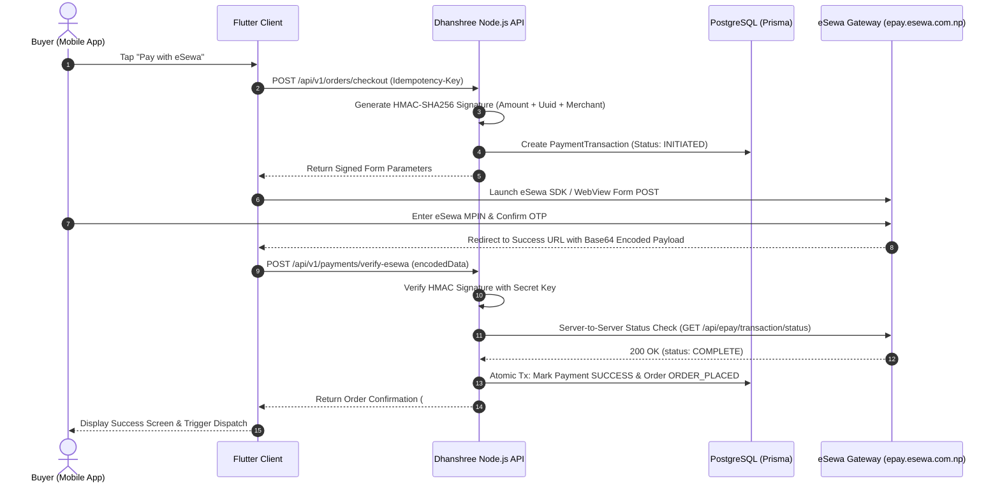
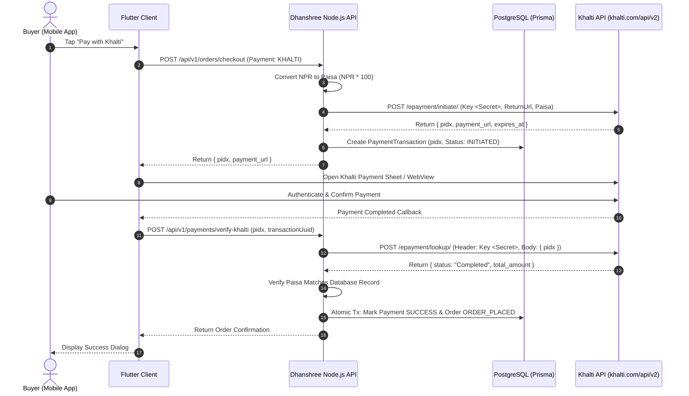
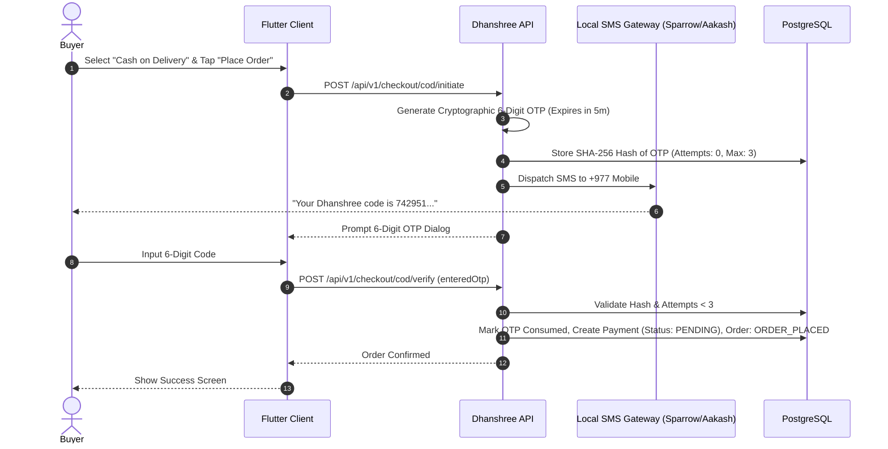

# Dhanshree FinTech Integration Specification (Nepal Market)

> **Role:** Senior FinTech Integration Engineer  
> **Market:** Nepal E-Commerce (eSewa, Khalti, Cash on Delivery, Sparrow SMS / Aakash SMS)  
> **Security Standards:** HMAC-SHA256 Signatures, TLS 1.3, Idempotency-Key HTTP Headers, Dual-Provider Failover

---

## 1. End-to-End Payment Flow Architectures

### 1.1 eSewa ePay 2.0 Integration Architecture



---

### 1.2 Khalti v2 e-Payment Integration Architecture



---

### 1.3 Cash on Delivery (COD) with Automated SMS OTP Confirmation



---

## 2. Error Handling & Edge-Case Safeguards

### 2.1 Duplicate Order Prevention via Idempotency Keys
Implemented in [`backend/middleware/idempotency_guard.ts`](file:///C:/Users/Admin/.gemini/antigravity/brain/a10408c1-0c7e-4f69-8ee6-ffc1f84eb625/backend/middleware/idempotency_guard.ts):
- Every checkout request must pass a client-generated UUID in `Idempotency-Key`.
- **States:**
  - `PROCESSING`: Returns HTTP `409 Conflict` if a twin request arrives while the first is running.
  - `COMPLETED`: Returns cached response with header `X-Idempotent-Replay: true`, preventing double debit.
  - `FAILED`: Cleans key to allow safe customer retry.

### 2.2 User Cancellation & Inventory Release
Implemented in [`backend/services/cod_verification_service.ts`](file:///C:/Users/Admin/.gemini/antigravity/brain/a10408c1-0c7e-4f69-8ee6-ffc1f84eb625/backend/services/cod_verification_service.ts):
- When a user cancels during eSewa/Khalti redirect or leaves COD unverified after 15 minutes:
  - Background worker marks `Order.orderStatus = CANCELLED`.
  - Atomically increments `ProductVariant.stockQuantity` for all item lines, ensuring stock is freed up for other shoppers.

---

## 3. Local SMS Gateway Integration (Sparrow & Aakash)

Implemented in [`backend/services/sms_gateway_service.ts`](file:///C:/Users/Admin/.gemini/antigravity/brain/a10408c1-0c7e-4f69-8ee6-ffc1f84eb625/backend/services/sms_gateway_service.ts):

### Provider Comparison & Auto-Failover Strategy

| Provider | API Endpoint | Auth Method | Delivery Speed in Nepal | Primary/Fallback Role |
| :--- | :--- | :--- | :--- | :--- |
| **Sparrow SMS (Janaki Tech)** | `http://api.sparrowsms.com/v2/sms/` | Query Token + Sender ID (`Dhanshree`) | ~3–5 seconds (Direct NTC/Ncell SS7 pipe) | **Primary Gateway** |
| **Aakash SMS** | `https://sms.aakashsms.com/sms/v3/send` | JSON `auth_token` | ~4–7 seconds | **Automatic Fallback** |

```typescript
// Auto-Failover Logic
try {
  return await sendViaSparrow(sanitizedNumber, message);
} catch (sparrowErr) {
  console.warn("Sparrow failed, falling back to Aakash SMS...");
  return await sendViaAakash(sanitizedNumber, message);
}
```

---

## 4. Sandbox Testing Credentials

### eSewa ePay Test Environment:
- **Product Code:** `EPAYTEST`
- **Secret Key:** `8gBm/:&EnhH.1/q`
- **Form URL:** `https://rc-epay.esewa.com.np/api/epay/main/v2/form`
- **Test Credentials:** ID: `9841000000` / Password: `Nepal@123` / MPIN: `1122`

### Khalti EPAY Test Environment:
- **Public Key:** `test_public_key_...`
- **Secret Key:** `live_secret_key_6821360862b2434f81014e308910b427` (Test mode activated on sandbox)
- **Initiate URL:** `https://a.khalti.com/api/v2/epayment/initiate/`
- **Test Credentials:** ID: `9800000000` / MPIN: `1111` / OTP: `987654`
