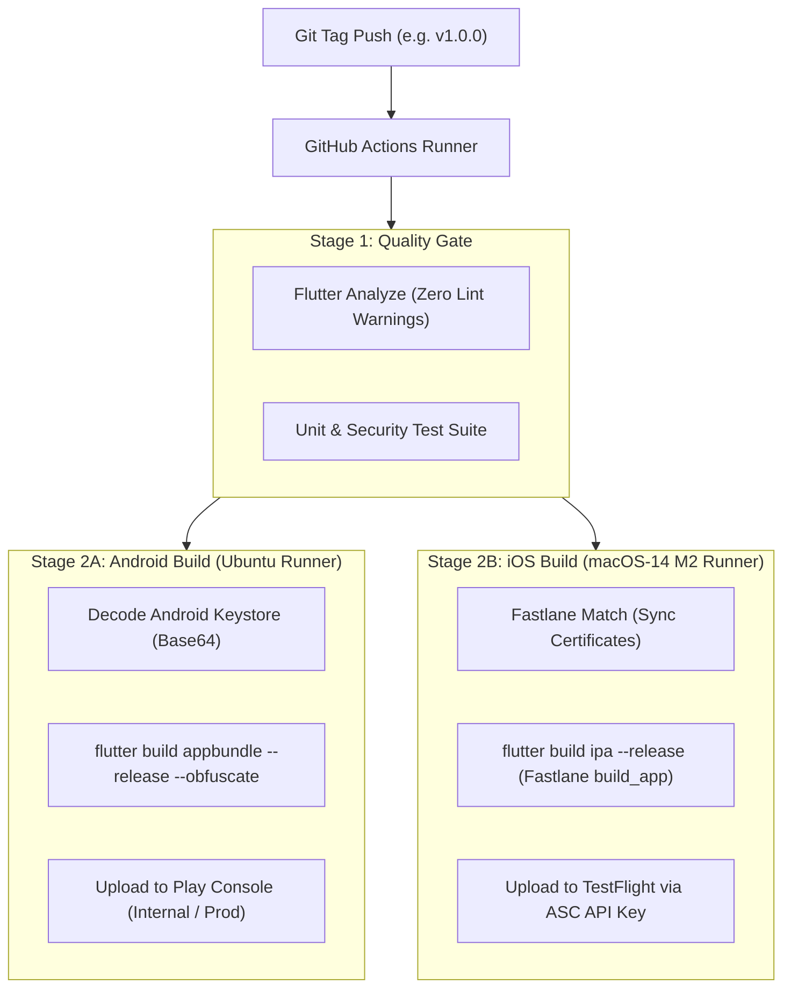

# Dhanshree Mobile DevOps & App Store Release Architecture

> **Role:** Mobile DevOps Engineer & App Store Release Specialist  
> **Target Stores:** Google Play Store (Android App Bundle `.aab`) & Apple App Store (TestFlight & App Store `.ipa`)  
> **Toolchain:** GitHub Actions, Fastlane 2.220+, Java 17, Ruby 3.2, Firebase Cloud Messaging (FCM)

---

## 1. Automated CI/CD Pipeline Architecture



### GitHub Repository Secrets Matrix

| Secret Name | Purpose | Source |
| :--- | :--- | :--- |
| `ANDROID_KEYSTORE_BASE64` | Base64-encoded production `.keystore` / `.jks` file | `base64 -w 0 dhanshree-release.keystore` |
| `KEYSTORE_PASSWORD` | Password for the release Keystore | Generated during Keystore setup |
| `KEY_ALIAS` | Key Alias identifier (e.g. `dhanshree-key`) | Keystore alias |
| `KEY_PASSWORD` | Private key password | Generated during Keystore setup |
| `PLAY_STORE_SERVICE_ACCOUNT_JSON` | Google Play Developer API Service Account Key | Google Cloud Console & Play Console |
| `APP_STORE_CONNECT_KEY_ID` | 10-character Key ID for App Store Connect | Apple Developer Portal (Users & Access) |
| `APP_STORE_CONNECT_ISSUER_ID` | UUID Issuer ID from App Store Connect | Apple Developer Portal |
| `APP_STORE_CONNECT_KEY_CONTENT` | Base64 of AuthKey `.p8` private key | Downloaded from Apple Developer Portal |
| `MATCH_PASSWORD` | Passphrase used to encrypt the Match Git repository | Private team passphrase |
| `MATCH_GIT_URL` | Private Git repository storing encrypted certs | GitHub / GitLab private repository |
| `MATCH_GIT_BASIC_AUTHORIZATION` | Personal Access Token (PAT) for Match repo | GitHub PAT with repo scope |

---

## 2. Google Play Console & Apple App Store Submission Checklist

### 2.1 Apple App Store Review Guideline 5.1.1(v) — Account Deletion
Apple strictly rejects e-commerce apps that allow account creation but do not support **in-app account deletion**.

- **Implementation:**
  - Route: `Settings` $\rightarrow$ `Account Security` $\rightarrow$ `Delete My Account` button.
  - API Contract: `DELETE /api/v1/users/me`.
  - Retention Policy: Immediately revokes all active JWT tokens, anonymizes phone numbers, but retains financial transaction records for 7 years as mandated by Nepal Inland Revenue Department (IRD) tax regulations.
  - Public Web Portal: `https://dhanshree.com.np/account-deletion` for users who uninstalled the app.

### 2.2 Native Permissions & Purpose Strings

#### iOS (`Info.plist`)
```xml
<!-- Camera Permission for Product Reviews & Seller KYC -->
<key>NSCameraUsageDescription</key>
<string>Dhanshree requires camera access to allow you to photograph products for customer reviews and verify seller identity.</string>

<!-- Photo Library Permission -->
<key>NSPhotoLibraryUsageDescription</key>
<string>Dhanshree requires photo library access to upload product pictures and dispute evidence.</string>

<!-- Location Permission for Nepal Ward Auto-Selection -->
<key>NSLocationWhenInUseUsageDescription</key>
<string>Dhanshree uses your location to auto-detect your province and municipality for accurate shipping cost calculation.</string>
```

#### Android (`AndroidManifest.xml`)
```xml
<!-- Notifications for Delivery Alerts (Android 13+) -->
<uses-permission android:name="android.permission.POST_NOTIFICATIONS" />

<!-- Camera for Barcode Scanning & Reviews -->
<uses-permission android:name="android.permission.CAMERA" />

<!-- Network State for Adaptive 3G/4G Compression -->
<uses-permission android:name="android.permission.ACCESS_NETWORK_STATE" />
```

### 2.3 Data Safety & App Privacy Questionnaire
- **Personal Info:** Mobile Number & Name (Collected for account authentication & order fulfillment).
- **Approximate Location:** Province & District (Collected for delivery fee computation; not tracked continuously).
- **Financial Info:** Payment Transaction Reference IDs (eSewa / Khalti transaction codes; no raw bank passwords or card numbers are ever stored).
- **Encryption:** All data in transit is encrypted using **TLS 1.3**.

---

## 3. Firebase Cloud Messaging (FCM) Push Architecture

Implemented in [`backend/services/fcm_notification_service.ts`](file:///C:/Users/Admin/.gemini/antigravity/brain/a10408c1-0c7e-4f69-8ee6-ffc1f84eb625/backend/services/fcm_notification_service.ts) and [`lib/core/notifications/fcm_notification_service.dart`](file:///C:/Users/Admin/.gemini/antigravity/brain/a10408c1-0c7e-4f69-8ee6-ffc1f84eb625/lib/core/notifications/fcm_notification_service.dart):

### 3.1 Android Notification Channel Configuration
```xml
<!-- AndroidManifest.xml: High-Importance Channel for Doorstep Deliveries -->
<meta-data
    android:name="com.google.firebase.messaging.default_notification_channel_id"
    android:value="dhanshree_order_updates" />
```

### 3.2 APNs Certificate & Key Configuration (iOS)
1. Generate an **APNs Authentication Key (`.p8`)** in Apple Developer Portal under *Certificates, Identifiers & Profiles*.
2. In Firebase Console $\rightarrow$ *Project Settings* $\rightarrow$ *Cloud Messaging*, upload the `.p8` key with your Team ID and Key ID.
3. Enable **Push Notifications** and **Background Modes (Remote notifications)** capabilities in `Runner.xcworkspace`.

### 3.3 Transactional Triggers & Deep Linking
When an order changes state, the backend dispatches notifications:

| Trigger Event | Nepali Notification Copy | English Notification Copy | Target In-App Route |
| :--- | :--- | :--- | :--- |
| `ORDER_CONFIRMED` | *तपाईंको अर्डर स्वीकृत भयो! विक्रेताले सामान प्याक गर्दैछ।* | *Order Confirmed! The seller is preparing your items.* | `/orders/:orderId` |
| `OUT_FOR_DELIVERY` | *डेलिभरी राइडर तपाईंको टोलमा सामान लिएर आउँदैछ!* | *Out for Delivery! The rider will reach your tole today.* | `/orders/:orderId/track` |
| `PAYMENT_SUCCESS` | *इसेवा मार्फत रु ३,४५९ प्राप्त भयो।* | *रु 3,459 received via eSewa. Thank you!* | `/orders/:orderId` |
